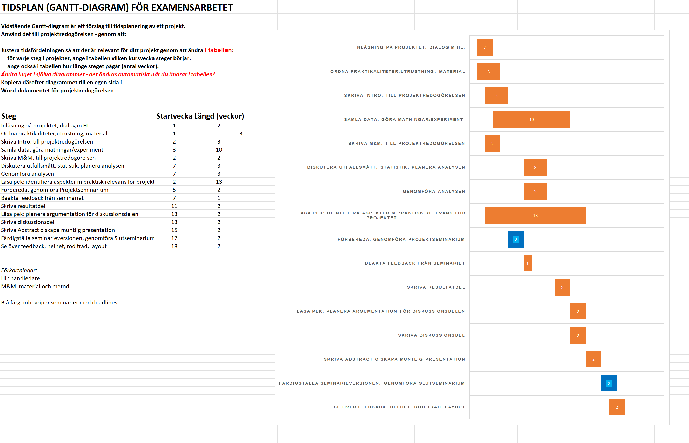

```{r setup, include=FALSE}
knitr::opts_chunk$set(echo = TRUE)
```

<!-- The project plan should be 3-4 pages long and written in
Rmarkdown (like this document). Remove all comments in italic when you 
use this document as a template for your own project plan. -->

<!-- This is an R Markdown document. Markdown is a simple formatting
syntax for authoring HTML, PDF, and MS Word documents. For more
details on using R Markdown see http://rmarkdown.rstudio.com -->

<!-- This is a comment and will not be present in the compiled
document. Try "knitting" this document by clicking the knit button up
to the left, or by running `rmarkdown::render("project-plan.Rmd")` in
the console and you should only see headings -->


Introduction
============

*This is part A) in the project plan [sv: projektredogörelse]. *

Trauma is a global issue affecting millions of people every year worldwide. The exact numbers differ due to different methods of gathering data, and data availability. Worldwide, somewhere between 4-6 million people die every year due to trauma, and around 40 million get permanently injured and 100 million people get temporarily injured each year (cite). In Sweden, during 2023, 5221 people died due to trauma (cite socialstyrelsen). The level of care a trauma patient receive can differ between hospitals, regions and countries. The level of care can differ according to severity of injury, but also according to local regulations, space and economical concerns. 
Level of care can be categorized according to five categories in order of most care to least care, emergency department, general ward, operating theatre, high dependency unit and critical care unit. Depending on the severity of the injury each patient supposedly ends up in a higher care level. A higher care level equals more doctors, nurses and staff, as well as access to more complex machinery. However, it also equals a higher cost, and a larger drain of resources. 
Each of these categories possibly have their own set of problems and opportunities for improvement. According to study (cite), many patients stay too long in the emergency ward before reaching the level of care required for treatment. On the other hand, studies show (cite) that there is a correlation with a longer stay in a critical care unit and patient recovery. We will discuss reasons for this in the discussion part of this paper.  
In this paper we aim at looking at opportunities for improvement regarding level of care. Opportunities for improvement can be categorized as factors affecting morbidity and mortality. We will also discuss whether patients end up in the right care level according to the severity of their injuries, or if they end up in a potentially higher care level then required, thus costing money and resources. 


*The background/introduction should summarise the scope of the problem,
what is known about the problem, what is not known, what specific
knowledge gap the study is supposed to fill and why this is
important. It should end be stating the aim of the study. The
background should be 4-5 paragraphs long and each paragraph should be
between 3-5 sentences. Strive to make the paragraphs about the same
length.*

*bibliography.bib includes an example reference. Add additional
references in that file as bibtex entries and then cite in text using:
"[@exampleKey9999]". One can convert DOIs' to bibtex entries using 
https://www.doi2bib.org/. If you use Zotero you can simply export 
entries to bibtex `Ctrl-Shift-C`, however you need to first setup 
Quick Copy to export to bibtex (https://www.zotero.org/support/creating_bibliographies#quick_copy)*

Methods
=======

To answer these questions, we will use the trauma care quality database and trauma registry from Karolinska University hospital. Using these two databases we will conduct a registry-based cohort study. The data available in the trauma registry includes 14000 trauma patients and is logged from the years 2012-2023. The data from the trauma care quality database is a subset of the same data containing 8000 patients where opportunities for improvement have also been logged. This project will examine whether there are specific opportunities for improvement in regards to the level of care these patients received. 
RStudio will be used in order to extract the data needed to answer these questions. 
Relevant literature will be found on Pubmed using relevant search queries, including but not limited to “trauma”, “level of care” and “improvement”.
A 5% significance level and 95% confidence levels will be used.


*Refer to the appropriate reporting guideline for details. If you are
developing, updating or validating a clinical prediction model then
use
[TRIPOD](https://www.equator-network.org/reporting-guidelines/tripod-statement/). If
you are conducting an observational study, for example a cohort or
case control study in which you assess associations between some
exposure and an outcome then use
[STROBE](https://www.equator-network.org/reporting-guidelines/strobe/).*


Purpose
The purpose of this paper is to find opportunities for improvement regarding trauma and level of hospital care. Different levels of hospital care may affect opportunities for improvement in the treatment of adult patients with trauma.


Project Update and Timeline
===========================

Week 1:
-	Introduce myself to the NOACS team.
-	Familiarize myself with GitHub, RStudio.
-	Attend lectures and take part of material from Karolinska. 

Week 2:
–  Start looking at relevant articles for background. 
-	Create first draft of the project plan
-	Create first draft of the manuscript
-	Learn how to use RStudio by practising in the program Swirl. 


Week 3:
-	Compile all relevant articles for the project plan, and most of the relevant articles for the background. 
-	Create a version of the project plan that’s almost finished (finished from my end, pending control from my supervisor) 
-	Use Zotero for the references
-	Start using RStudio in order to work with the relevant data
Week 4
-	Revise project plan based on feedback from supervisor. 
-	Add code that creates a first table of sample characteristics.
-	Work with the code and with RStudio
Week 5- 7
-	Keep writing introduction and methods
-	Write code that generates results based on the training data. Revise the code based on feedback from my supervisor and team.

Week 7-10 
-	Work on the real patient data with my code. Revise code as needed
Week 11-12
-	Write results part of thesis.

Week 13-14
-	Revise results based on feedback
-	Write discussion
Week 15
-	Revise discussion based on feedback 
-	Draft complete thesis

Week 16-17
-	Revise thesis and abstract as needed
Week 18 – 20 
-	Revise based on feedback from Karolinska 


Right now
I’m currently learning how to code in RStudio, which is taking up most of my time. I’m also looking for relevant articles in order to start writing the introduction part of the thesis. 
The data I’m going to be looking at is register based data using patient data registers at Karolinska. I’m going to create a code which looks at variables concerning level of care and opportunities for improvement. I’m not entirely sure how I will present this data, but some sort of graph seems to me a good choice. I will have to analyze it first, and possibly also draft the “results” part of the thesis before I decide on the best course of action. 


*This is part B) in the project plan [sv: projektredogörelse]. *

*Save the image generated from the Gantt chard spreadsheet into the assets folder, rename it to project-gantt.png*



Ethical permit and consideration
Ethical permit: 2021-02541, 2021-03531 and 2023-02975-02
In this project, personal patient data will be used without identifying the patient. It will also be done without the patient’s direct consent. There are, however, no reason to believe that a patient would not accept being part of registry if asked. Care will be taken in order to not spread the data to people outside of the scope of the study. 
The purpose of this study is to improve the quality of care for trauma patients. There are no apparent risks that this study may be used for malicious use. It is possible that this study may be used for future commercial use by a private health center. This would most likely be to the benefit of the patients in this health center and is therefore not a valid reason for not publishing this study. 
It's possible that when spending time on this study, time and resources are used that could be better spent elsewhere, and on other studies. This is an argument that could be made of every study ever made, and since this study is not using up any finite resource (except for arguably time), this is not a valid argument for discontinuing the study. 


Back-up Plan
============

This paper depend to a large part on my ability to create good enough code. I don’t appreciate any significant problems regarding other areas, though they my certainly arise. I will communicate clearly to my supervisor in case I don’t manage to create good enough code, and hopefully the team will have a good way of helping me learn how to code.


*This is part C) in the project plan [sv: projektredogörelse]*

References
==========

<!-- Do not edit by hand, references will be inserted and formatted automatically once you knit this document -->
